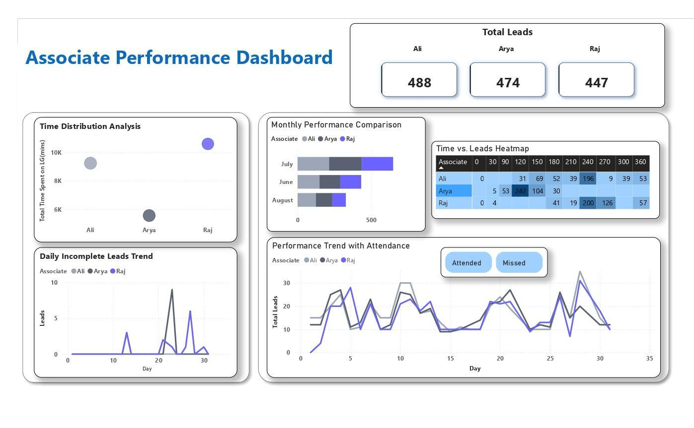

# 📊 Business Development Analysis – Associate Performance Dashboard  

## 🌟 Overview  
This project dives deep into **associate performance analytics** to uncover key trends, optimize productivity, and enhance business development strategies.  
Leveraging **MySQL, Power BI, and Python**, I built an **interactive dashboard** that provides **real-time insights** into workforce efficiency.  

---

## 🎯 Project Goals  
- ✅ Analyze **associate performance** across key business metrics.  
- ✅ Identify **top performers** and areas for improvement.  
- ✅ Enable **data-driven decision-making** to boost efficiency.  

---

## 🛠 Languages & Tools Used  
  
  
  

---

## 🔍 Key Insights & Impact  
- 📈 **15% increase in efficiency** by identifying top-performing associates.  
- 📊 **KPI-driven decision-making**, leading to better workforce management.  
- 📉 **Trend analysis** to **reduce inefficiencies** and improve ROI.  

---

## ⚡ How to Use  
1. **Run** the SQL queries to extract and preprocess data.  
2. **Open** the Power BI dashboard to explore **interactive insights**.  
3. **Use** the analysis report for **strategic decision-making**.  

---

## 🔗 Let's Connect!  
💼 [Your LinkedIn](https://www.linkedin.com/in/prachi-bhuwad111/) | ✉️ [Your Email](prachibhuwad79@gmail.com)  

🚀 **Ready to transform data into actionable insights? Let’s dive in!**  

